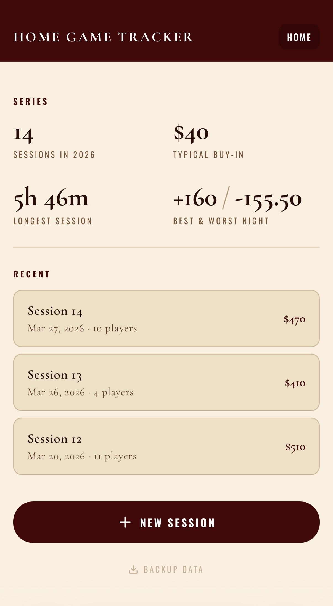
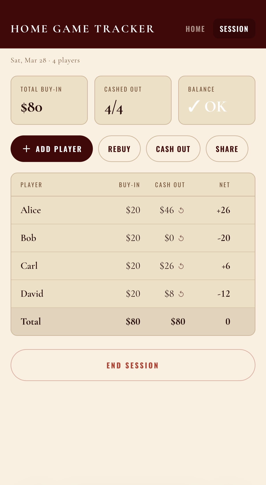

# *AKo* — Poker Home Game Manager

<p align="center">
  <a href="LICENSE"></a>
  <a href="https://vercel.com"></a>
  <a href="https://supabase.com"></a>
</p>

Self-hosted web app for home game hosts to track buy-ins, cashouts, and balances during a session. Share a link with your group and they can follow along live. Data stays in your own Supabase database.

No player accounts needed. Your group just opens the link. Admin access is PIN-protected, and the full session data never leaves your database — see [Security](#security) for how that works.

<p align="center">
  
  &nbsp;&nbsp;&nbsp;&nbsp;
  
</p>

## Features

- Share a URL and your group sees the session live — works on any phone browser, no app install needed
- Full session history with series stats — sessions played, typical buy-in, longest session, biggest swing
- Buy-ins, rebuys, cashouts, undo cashout. Player name autocomplete from past games
- Generate a screenshot card ranked by net profit, share via Web Share API or save as PNG
- One-click JSON backup of all data
- Mobile-first — meant for phones at the table
- Runs on Vercel + Supabase free tiers

## Install

You need free accounts on [Vercel](https://vercel.com) and [Supabase](https://supabase.com).

### Step 1 — Set up the database

Go to [supabase.com/dashboard](https://supabase.com/dashboard) and create a new project. Once ready, open the **SQL Editor** and paste the contents of [`supabase/migrations/20260101000000_init.sql`](supabase/migrations/20260101000000_init.sql) — this creates the tables, security policies, and enables Realtime in one shot.

Then go to **Project Settings → API** and copy:
- **Project URL** — looks like `https://abcdefg.supabase.co`
- **anon public key** — the shorter JWT under "Project API keys"
- **service_role secret** — the longer JWT (click Reveal). Keep this one private.

### Step 2 — Deploy to Vercel

Click the button below. It clones the repo to your GitHub, prompts you for the keys from Step 1, and deploys.

[](https://vercel.com/new/clone?repository-url=https://github.com/LMC4S/AKo&project-name=ako&repository-name=ako&env=VITE_SUPABASE_URL,VITE_SUPABASE_ANON_KEY,SUPABASE_URL,SUPABASE_SERVICE_KEY,ADMIN_PIN,ADMIN_API_SECRET&envDescription=VITE_SUPABASE_URL%20and%20VITE_SUPABASE_ANON_KEY%3A%20from%20Supabase%20Project%20Settings%20%E2%86%92%20API.%20SUPABASE_URL%3A%20same%20as%20VITE_SUPABASE_URL.%20SUPABASE_SERVICE_KEY%3A%20service_role%20secret%20from%20Supabase.%20ADMIN_PIN%3A%20your%20admin%20password.%20ADMIN_API_SECRET%3A%20run%20openssl%20rand%20-hex%2032%20to%20generate.)

When prompted for env vars:

| Variable | Where to get it |
|---|---|
| `VITE_SUPABASE_URL` | Supabase → Project Settings → API → Project URL |
| `VITE_SUPABASE_ANON_KEY` | Supabase → Project Settings → API → anon public key |
| `SUPABASE_URL` | Same as `VITE_SUPABASE_URL` |
| `SUPABASE_SERVICE_KEY` | Supabase → Project Settings → API → service_role secret |
| `ADMIN_PIN` | Pick anything — this is your admin password |
| `ADMIN_API_SECRET` | Run `openssl rand -hex 32` in your terminal |

### Step 3 — Start playing

Once deployed, Vercel gives you a URL like `https://ako.vercel.app`.

- **You** (admin): go to `https://ako.vercel.app/admin`, enter your PIN, create a session.
- **Your group**: send them `https://ako.vercel.app`. No login needed — they see standings update live.

Custom domain: Vercel project → **Settings → Domains**.

## Local development

**Local dev is for working on the code.** To actually use AKo with your group, [deploy to Vercel](#install).

```bash
npm install
npm run dev
```

This starts Vite on `localhost:5173` and opens the admin page automatically.

- **`localhost:5173/admin`** — admin panel (manages sessions)
- **`localhost:5173`** — public observer view (what your group sees)

Without the API running, type anything into the PIN gate and it'll let you through. Data saves to `localStorage`. No accounts or setup needed — just run and go.

To connect to your Supabase database locally, copy the example env file and fill in your keys:

```bash
cp .env.example .env.local
# edit .env.local with your Supabase keys
npx vercel dev
```

This starts the app on `localhost:3000` with working API routes and PIN protection. The default PIN is `AKo` (set in `.env.example`). Change `ADMIN_PIN` in your `.env.local` to use your own. On Vercel, you set `ADMIN_PIN` as an environment variable in your project settings.

## Stack

| Layer | Tech |
|---|---|
| **UI** | React 18 + Vite |
| **Database** | Supabase (Postgres + Realtime) |
| **API** | Vercel Serverless Functions |
| **Sharing** | html2canvas + Web Share API |
| **Fonts** | Oswald, Cormorant Garamond, Inter |

## Architecture

```
        Admin (phone at the table)            Observers (shared link)
                  │                                     │
                  ▼                                     ▼
         ┌──────────────┐                     ┌──────────────────┐
         │  /api/auth   │                     │  Supabase client │
         │  /api/sessions│                    │  (anon key)      │
         │  (serverless) │                     └────────┬─────────┘
         └───────┬───────┘                              │
                 │                                      │
    ┌────────────┼──────────────────┐                   │
    ▼            ▼                  ▼                    ▼
poker_data   compute         poker_public ◄── Realtime subscribe
(full history) snapshot      (read-only)
```

| | Public (`/`) | Admin (`/admin`) |
|---|---|---|
| **Access** | Anyone with the link | PIN required |
| **Data** | `poker_public` (snapshot) | `poker_data` (full history) |
| **Updates** | Supabase Realtime push | 5-second polling |
| **Writes** | None | `x-admin-secret` header |

## Security

Two separate database tables — `poker_data` (private, RLS blocks all anonymous access) and `poker_public` (read-only snapshot for observers). The server decides what goes into the snapshot on each save. Admin PIN is SHA-256 hashed before it leaves the browser, and the only credential in the client bundle is the Supabase anon key, which can only read the public table. All writes require a server-side secret check.

## License

MIT
